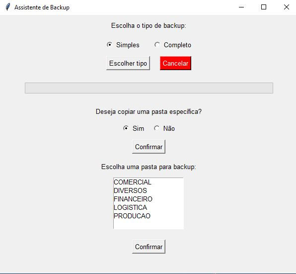
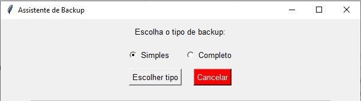

### Backup Automatizado de pastas e arquivos em Rede
- copiar os arquivos da rede para um HD externo
- possibilidade de não copiar pastas específicas
- não copiar os arquivos: thumbs.db, desktop.ini

#### Bibliotecas
- python.exe -m pip install --upgrade pip
- os
- shutil
- datetime
- tkinter
- threading

#### Criar um .bat simples
- executar_backup.bat

#### Tela Inicial

#### Escolher o tipo de backup

#### Digite a letra do HD externo

#### Escolher copiar todas as pastas ou uma específica

#### Escolher a pasta específica para backup

